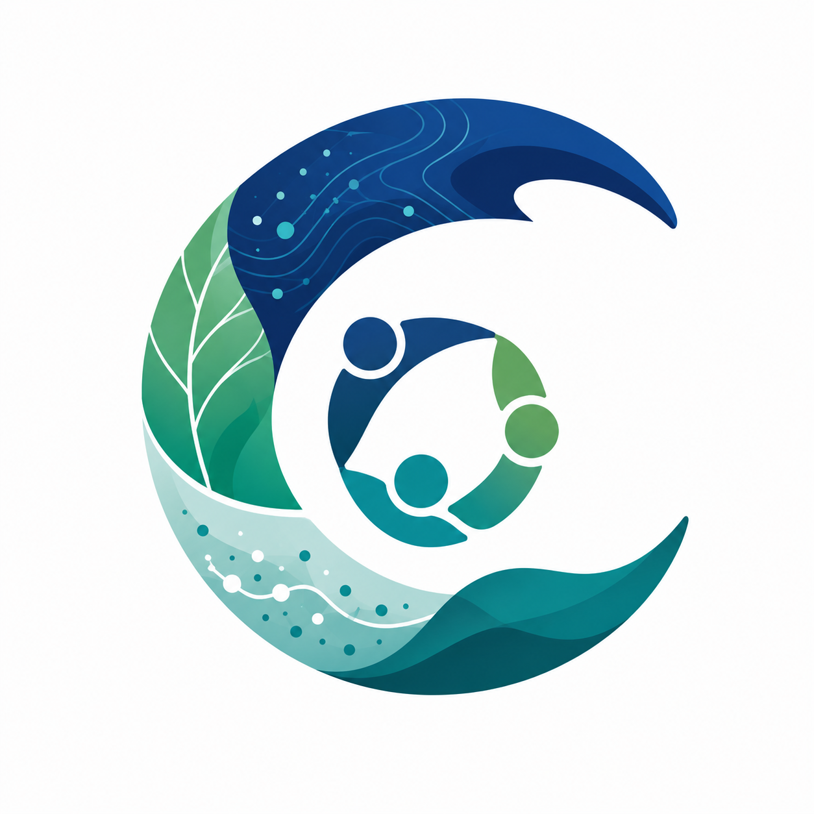

<section class="scienceclaw-title" markdown>
{ .scienceclaw-title-logo }

# OASIS ScienceClaw

**ESIIL's multi-agent workspace**

Run an environmental synthesis workspace on your laptop, keep agent access narrow, and publish reviewed outputs without mixing private workspace files into the public site.
</section>

[ScienceClaw workspace](scienceclaw.md){ .md-button .md-button--primary }
[OASIS template](oasis-template.md){ .md-button }
[Read the setup guide](setup.md){ .md-button }
[Alpha baseline](alpha.md){ .md-button }
[Operations](operations.md){ .md-button }
[Template governance](template-governance.md){ .md-button }
[Distributed runtime](distributed-runtime.md){ .md-button }
[Workspace CMS](workspace-cms.md){ .md-button }
[Storage model](storage/index.md){ .md-button }
[Publishing workflow](publishing-workflow.md){ .md-button }
[Model routing](model-routing.md){ .md-button }
[Model/auth options](model-options.md){ .md-button }
[Example snapshots](example-snapshots.md){ .md-button }

<div class="grid cards" markdown>

- **Local control**

  ---

  Build the image yourself, persist config on your machine, and decide exactly which project files are mounted into `/workspace`.

- **Model options**

  ---

  Start with ChatGPT/Codex OAuth when available, or switch to API-key mode when repeatable automation matters more.

- **Safe workspace**

  ---

  Keep agent access focused on `./workspace` and `/data` instead of exposing your whole home directory or unrelated cloud folders.

- **Bootstrapped defaults**

  ---

  Start with the local Gateway, Control UI origins, Codex model route, `/data` layout, and starter heartbeat/soul workspace files already initialized by the image.

- **Scientific working group**

  ---

  Use an 11-role environmental data science scaffold with a PI Liaison, shared memory, evidence standards, skeptic review, and human approval gates.

- **Distributed runtime**

  ---

  Launch bounded local worker jobs now and render optional Kubernetes Job manifests for future stream-first spatial-temporal analysis.

- **Workspace CMS**

  ---

  Review private drafts, attach provenance/status sidecars, and promote approved pages into the public MkDocs source.

- **External storage**

  ---

  Keep large data and outputs outside git and the image while registering streamable STAC, COG, Zarr, Parquet, S3, WebDAV, iRODS, or local stores.

</div>

## Start Here

```bash
docker compose build
scripts/login-codex.sh
scripts/status.sh
```

The full walkthrough is in the [setup guide](setup.md). The [model/auth options](model-options.md) page explains when OAuth, API keys, hosted service, or local models make sense.

Use [ScienceClaw Workspace](scienceclaw.md) for the `/data` layout, brand foundation, optional JupyterLab workspace UI, and installed tool baseline.

Use [OASIS ScienceClaw Template](oasis-template.md) for the spawnable working-group philosophy, canonical configuration, cockpit file, and workspace conventions.

Use [Distributed runtime](distributed-runtime.md) for worker jobs, STAC/COG/Zarr examples, Kubernetes scaffolding, and output indexing.

Use [Workspace CMS](workspace-cms.md), [Storage architecture](storage/index.md), and [Publishing workflow](publishing-workflow.md) to move from private `/workspace` drafts to reviewed public MkDocs reports and dashboards.

Read [Security](security.md) before connecting Slack tokens to the PI Liaison.

Use the [Operations guide](operations.md) for the reproducible Slack pairing, live Gateway OAuth refresh, and smoke-test sequence.

Use [Template governance](template-governance.md) to see which norms, protocols, role notes, data directories, and review checklists are seeded by default.

Use [Model routing](model-routing.md) to keep the PI Liaison and Scientific Director on high-reliability routes while testing open-model APIs for bounded specialist roles.

Use [Example snapshots](example-snapshots.md) to see curated outputs captured from live container sessions without committing the whole local workspace.
