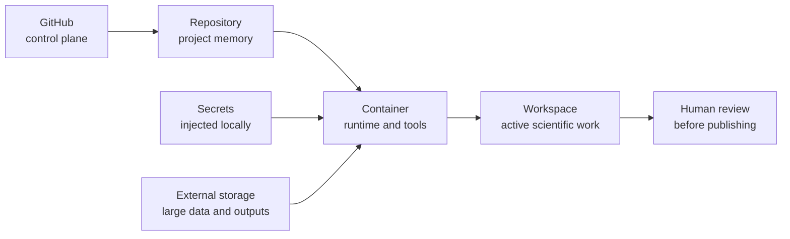

# Start Here

This section is for the first ten minutes with OASIS ScienceClaw.

OASIS ScienceClaw is a reproducible scientific working group environment. The container gives you a ready-to-use runtime, the repository gives you durable project memory, and the workspace gives agents and humans a shared place to write down decisions, notes, tasks, data manifests, and reviewed outputs.

!!! note "You do not need to understand Docker deeply to begin"
    Start by treating the container as a portable lab bench: it holds the tools. The repository is the lab notebook: it holds the memory.

## The Core Mental Model



Repeat this when you feel lost:

**GitHub = control plane. Repo = memory. Container = runtime. Secrets are injected, never stored. External storage holds large durable data.**

## First Path

1. Read [First 10 Minutes](first-10-minutes.md).
2. Launch the workspace with [Launch Locally](../use/launch-locally.md).
3. Open the [Working Group Cockpit](../use/working-group-cockpit.md).
4. Learn [Where Files Go](../use/where-files-go.md).
5. Check the [Troubleshooting](../troubleshooting.md) page if anything feels strange.

The calm command loop is:

```bash
make init-working-group
make doctor
make checkpoint
```

## User Modes

| Mode | Start With | Main Concern |
| --- | --- | --- |
| Everyday Scientist | [First 10 Minutes](first-10-minutes.md) | Doing useful work without learning infrastructure first |
| Working Group Lead | [Create from Template](../oasis-template.md) | Making a reusable working group from the base image |
| Data/Workflow Maintainer | [Where Files Go](../use/where-files-go.md) | Data placement, provenance, and reproducible outputs |
| Infrastructure Admin | [Operations](../operations.md) | Ports, credentials, startup, and deployment |
| Developer/Customizer | [Template Governance](../template-governance.md) | Extending agents, docs, branding, and workflows |
